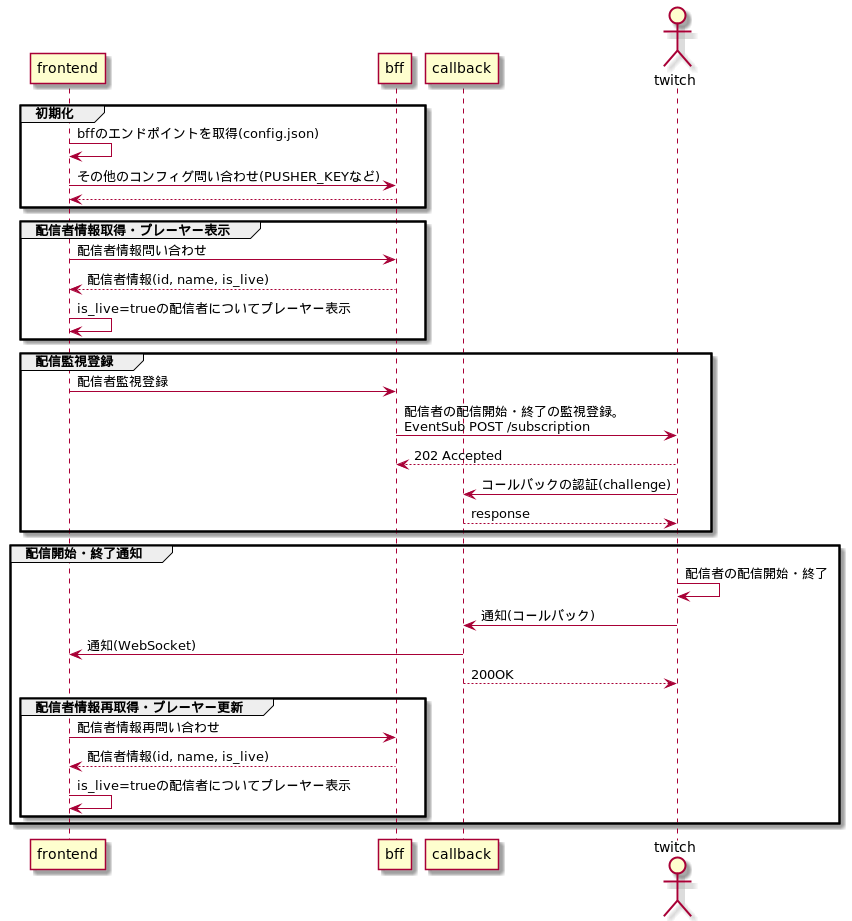

# twitch multi-player reactive

配信者の配信開始・終了に応じて自動的にプレーヤーを増減し、敷き詰めます。

# プレーヤー外部仕様

クエリパラメータで配信者名とオプションを指定します。

```
https://wand2016.github.io/twitch-multi-player-reactive/?width=1600&height=900&streamer=streamer_a,streamer_b,streamer_c
```

- `streamers`
  - 配信者名をカンマ区切り
- `width`, `height`
  - この幅(width)/高さ(height)の中でプレーヤーを敷き詰めます
  - 単位はピクセルです
  - 未指定時は `window.innerWidth`, `window.innerHeight` にフォールバックします
  
# 構成

- frontend
  - ブラウザで動作するプレーヤー部分
- backend/bff
  - frontendから見て、twitch APIのBFFにあたるサーバー
- backend/callback
  - twitchからのコールバックを受け取るサーバー
  - HTTPSで動作する必要あり (なので、ローカル開発時は [ngrok](https://ngrok.com/) 等を使用します)

## シーケンス




# 環境変数

.env

```
CLIENT_ID=
CLIENT_SECRET=
PUSHER_KEY=
PUSHER_SECRET=
PUSHER_APP_ID=
PUSHER_CLUSTER=
PUSHER_CHANNEL=my-channel
PUSHER_EVENT=my-event
HMAC_SECRET=123456789a
```

- `CLIENT_ID`,`CLIENT_SECRET`
  - twitch APIの認証用
    - https://dev.twitch.tv/docs/authentication
    - https://dev.twitch.tv/docs/authentication/getting-tokens-oauth/#oauth-client-credentials-flow
- `PUSHER_KEY`,`PUSHER_SECRET`,`PUSHER_APP_ID`,`PUSHER_CLUSTER`
  - サーバからブラウザへの通知に [pusher](https://pusher.com/) を使用しています
  - sign upしてサンプルコードの中のものを使用します
  - `PUSHER_SECRET`: 通知送信時に使用。backend/callbackの中で使っています
  - `PUSHER_KEY`: 通知送受信時に使用。backend/callback, frontendの中で使っています
- `PUSHER_CHANNEL`,`PUSHER_EVENT`
  - これは何でもいい
- `HMAC_SECRET`
  - 10文字以上
  - backend/callbackで、twitchからのコールバックリクエストの真性性を確認するのに使用します
    - Subscription登録時に署名鍵をつけて送ると、コールバックリクエストにHMAC-SHA256の署名がくっついて送られてきます

# 開発

## ローカル動作まで

```sh
cp .env.sample .env
# .envにいろいろ書く

npm ci
npm --prefix=backend ci
npm --prefix=frontend ci

# backendをローカルで起動 (3000番ポート)
npm run serve:offline
# ngrokを併用する場合
CALLBACK_ENDPOINT=$(curl -s localhost:4040/api/tunnels | jq -r '.tunnels[].public_url' | grep -E '^https') npm run serve:offline

# frontendをローカルで起動 (8080番ポート)
npm --prefix=frontend run serve
```


## デプロイまで

### backendビルド・デプロイ

serverless frameworkを使用しています。 要AWS-CLI

```sh
npm run deploy
```

**初回だけ下記の部分でエラー出る** そのうちなんとかしたい

```yaml
  environment:
    CALLBACK_ENDPOINT:
      # callbackのAPI Gatewayのエンドポイント
      # .serverless/cloudformation-template-update-stack.json でexport定義されている
      Fn::ImportValue: sls-twitch-multi-player-${opt:stage,'dev'}-HttpApiUrl
```

まだリソースができてないので怒られるという

```diff
  environment:
-   CALLBACK_ENDPOINT:
-     # callbackのAPI Gatewayのエンドポイント
-     # .serverless/cloudformation-template-update-stack.json でexport定義されている
-     Fn::ImportValue: sls-twitch-multi-player-${opt:stage,'dev'}-HttpApiUrl
+   CALLBACK_ENDPOINT: ""
```

```
...

endpoints:
  ANY - https://xxxxxxxxxx.execute-api.ap-northeast-1.amazonaws.com/dev/
  ANY - https://xxxxxxxxxx.execute-api.ap-northeast-1.amazonaws.com/dev/{proxy+}
```

frontendのデプロイで使うので、`https://xxxxxxxxxx.execute-api.ap-northeast-1.amazonaws.com/` の部分を控えておきます

### frontendビルド・デプロイ

デプロイ先のパスに応じてvue.config.jsの`publicPath`の設定が必要

```js
module.exports = {
  publicPath:
    process.env.NODE_ENV === "production"
      ? "/twitch-multi-player-reactive/"
      : "/",
};
```

ビルド

```sh
npm --prefix=frontend run build
```

frontend動作時、コンフィグ類はBFFサーバから取ってきますが、BFFサーバのエンドポイント情報だけはconfig.jsonから同期XHRで取ってくる作りになっています  
(あとで変えるかも)

それを先ほど控えたAPIエンドポイントで書き換える。

frontend/dist/config.json

```diff
  {
-   "API_ENDPOINT": "http://localhost:3000/dev/api/"
+   "API_ENDPOINT": "https://xxxxxxxxxx.execute-api.ap-northeast-1.amazonaws.com/dev/api/"
  }
```

あとは S3+CloudFront なり GitHub Pages なりにデプロイしてください
